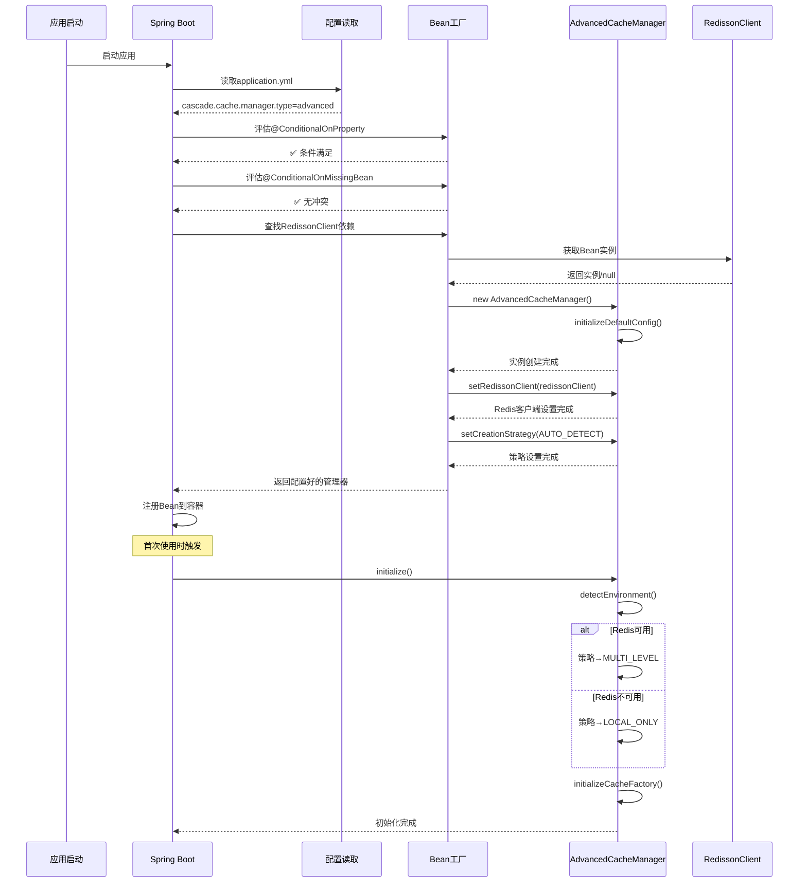

# AdvancedCacheManager 创建流程详解

## 📋 概述

本文档详细说明了 `AdvancedCacheManager` Bean 在 Spring Boot 自动配置中的完整创建流程，包括条件判断、依赖注入、智能检测等核心机制。

## 🎯 核心配置方法

```java
@Bean
@ConditionalOnProperty(prefix = "cascade.cache.manager", name = "type", havingValue = "advanced")
@ConditionalOnMissingBean(io.github.cascade.cache.api.CacheManager.class)
public io.github.cascade.cache.manager.AdvancedCacheManager advancedCacheManager(RedissonClient redissonClient) {
    io.github.cascade.cache.manager.AdvancedCacheManager manager = 
        new io.github.cascade.cache.manager.AdvancedCacheManager();
    
    // 设置RedissonClient
    manager.setRedissonClient(redissonClient);
    
    // 设置创建策略为自动检测（最智能的模式）
    manager.setCreationStrategy(io.github.cascade.cache.manager.AdvancedCacheManager.CacheCreationStrategy.AUTO_DETECT);
    
    return manager;
}
```

## 🔄 完整创建流程

### 阶段1: Spring Boot 启动期条件评估

#### 1.1 配置文件读取
```yaml
# application.yml
cascade:
  cache:
    manager:
      type: advanced  # 🎯 关键配置
```

#### 1.2 条件注解评估

| 注解 | 作用 | 评估逻辑 |
|------|------|---------|
| `@ConditionalOnProperty` | 配置条件 | 检查 `cascade.cache.manager.type=advanced` |
| `@ConditionalOnMissingBean` | Bean冲突检查 | 确保容器中没有其他 `CacheManager` |

**评估流程**:
```
Spring Boot 启动
    ↓
读取 application.yml
    ↓
检查 cascade.cache.manager.type
    ↓
┌─ type = "advanced" → ✅ 条件满足
├─ type = "simple" → ❌ 跳过创建
├─ type 未配置 → ❌ 跳过创建  
└─ type = 其他值 → ❌ 跳过创建
    ↓
检查容器中是否已有 CacheManager Bean
    ↓
┌─ 没有 → ✅ 可以创建
└─ 已有 → ❌ 避免冲突，跳过创建
    ↓
准备创建 AdvancedCacheManager
```

### 阶段2: 依赖注入解析

#### 2.1 RedissonClient 依赖查找
```java
public AdvancedCacheManager advancedCacheManager(RedissonClient redissonClient)
```

**Spring 依赖解析过程**:
```
Spring 扫描方法参数
    ↓
查找 RedissonClient Bean
    ↓
┌─ 找到 → 注入实例
├─ 未找到但可选 → 注入 null
└─ 未找到且必需 → 抛出异常
    ↓
准备调用Bean工厂方法
```

### 阶段3: Bean 实例化

#### 3.1 构造函数调用
```java
// 1. 创建实例
AdvancedCacheManager manager = new AdvancedCacheManager();
```

**构造函数内部执行**:
```java
public AdvancedCacheManager() {
    initializeDefaultConfig();  // 初始化默认配置
}

private void initializeDefaultConfig() {
    this.defaultConfig = new CacheConfig();
    // 设置默认值:
    // - 缓存大小: 10000
    // - 创建策略: AUTO_DETECT
    // - 其他默认配置...
}
```

#### 3.2 属性配置
```java
// 2. 设置 Redis 客户端
manager.setRedissonClient(redissonClient);
```

**setRedissonClient 方法执行**:
```java
public void setRedissonClient(RedissonClient redissonClient) {
    this.redissonClient = redissonClient;
    logger.info("RedissonClient set successfully");
    
    // 保存引用，后续环境检测时使用
    // redissonClient != null 表示Redis环境可用
}
```

#### 3.3 策略设置
```java
// 3. 设置智能检测策略
manager.setCreationStrategy(CacheCreationStrategy.AUTO_DETECT);
```

**setCreationStrategy 方法执行**:
```java
public void setCreationStrategy(CacheCreationStrategy strategy) {
    this.creationStrategy = strategy;
    logger.info("Cache creation strategy set to: " + strategy);
    
    // AUTO_DETECT 策略说明:
    // - 有Redis → 自动选择 MULTI_LEVEL (多级缓存)
    // - 无Redis → 自动选择 LOCAL_ONLY (本地缓存)
}
```

### 阶段4: Bean 注册与返回

```java
// 4. 返回配置完成的管理器
return manager;
```

**Spring Bean 注册**:
```
Bean工厂方法返回实例
    ↓
Spring 将实例注册到容器
    ↓
Bean名称: advancedCacheManager
Bean类型: AdvancedCacheManager
生命周期: Singleton (单例)
    ↓
其他组件可通过 @Autowired 注入
```

## 🚀 延迟初始化流程

### 5.1 首次使用触发初始化

当 `AdvancedCacheManager` 首次被使用时（例如调用 `createCache()` 方法），会触发初始化：

```java
@Override
public void initialize() throws Exception {
    if (state.compareAndSet(Lifecycle.State.NEW, Lifecycle.State.INITIALIZING)) {
        try {
            logger.info("Initializing AdvancedCacheManager...");

            // 🎯 关键步骤1: 环境检测
            detectEnvironment();

            // 🎯 关键步骤2: 初始化缓存工厂
            initializeCacheFactory();

            state.set(Lifecycle.State.INITIALIZED);
            logger.info("AdvancedCacheManager initialized successfully");
        } catch (Exception e) {
            state.set(Lifecycle.State.FAILED);
            throw e;
        }
    }
}
```

### 5.2 智能环境检测

```java
private void detectEnvironment() {
    if (redissonClient != null) {
        // 🎯 Redis环境可用
        logger.info("Redis environment detected");
        if (creationStrategy == CacheCreationStrategy.AUTO_DETECT) {
            // 自动升级为多级缓存策略
            creationStrategy = CacheCreationStrategy.MULTI_LEVEL;
        }
    } else {
        // 🎯 仅本地环境
        logger.info("Local-only environment detected");
        if (creationStrategy == CacheCreationStrategy.AUTO_DETECT) {
            // 自动降级为本地缓存策略
            creationStrategy = CacheCreationStrategy.LOCAL_ONLY;
        }
    }
}
```

**检测结果对比**:

| 环境条件 | RedissonClient | 自动策略选择 | 缓存能力 |
|---------|---------------|-------------|---------|
| 🌐 **分布式环境** | ✅ 存在 | `MULTI_LEVEL` | L1本地 + L2Redis + 同步 |
| 🏠 **单机环境** | ❌ 不存在 | `LOCAL_ONLY` | 仅L1本地缓存 |

### 5.3 缓存工厂初始化

```java
private void initializeCacheFactory() {
    if (customCacheFactory == null && creationStrategy != CacheCreationStrategy.CUSTOM_FACTORY) {
        // 设置默认工厂
        customCacheFactory = this::createDefaultCacheInstance;
    }
}

private <K, V> Cache<K, V> createDefaultCacheInstance(String cacheName) {
    return new CascadeCacheBuilder<K, V>(cacheName, this).build();
}
```

## 📊 完整时序图



## 🎯 智能特性详解

### 1. 条件化创建
- **优势**: 只有用户明确配置才创建，避免资源浪费
- **实现**: `@ConditionalOnProperty` 精确控制
- **配置**: `cascade.cache.manager.type=advanced`

### 2. 依赖智能注入
- **灵活性**: RedissonClient 可选依赖
- **容错性**: 无Redis时自动适配
- **解耦**: 不强制依赖特定Redis配置

### 3. 环境自适应
- **检测时机**: 延迟到首次使用
- **策略选择**: 根据实际环境自动调整
- **性能优化**: 避免无效的Redis连接尝试

### 4. 状态管理
```java
// 生命周期状态
enum State {
    NEW,           // 刚创建
    INITIALIZING,  // 初始化中
    INITIALIZED,   // 已初始化
    STARTING,      // 启动中
    STARTED,       // 已启动
    STOPPING,      // 停止中
    STOPPED,       // 已停止
    FAILED         // 失败
}
```

## 🔧 配置示例

### 启用 AdvancedCacheManager
```yaml
# application.yml
cascade:
  cache:
    enabled: true
    manager:
      type: advanced  # 🎯 关键配置
    defaults:
      l1:
        enabled: true
        maximumSize: 10000
      l2:
        enabled: true
        keyPrefix: "app:"
```

### 使用示例
```java
@Service
public class CacheService {
    
    @Autowired
    private AdvancedCacheManager cacheManager;
    
    @PostConstruct
    public void init() {
        // 智能缓存管理已自动配置完成
        
        // 创建智能缓存 - 自动根据环境选择策略
        Cache<String, User> userCache = cacheManager.<String, User>cacheBuilder("users")
                .maximumSize(1000)
                .expireAfterWrite(Duration.ofHours(1))
                .build();
        
        // 批量创建
        cacheManager.createCaches("users", "products", "orders");
    }
}
```

## 📈 性能与优势

### 对比传统方式

| 特性 | 传统手动配置 | AdvancedCacheManager |
|------|------------|---------------------|
| **配置复杂度** | 高 - 需要大量手动配置 | 低 - 一行配置启用 |
| **环境适配** | 需要手动判断 | 自动检测适配 |
| **错误处理** | 手动处理各种异常 | 内置容错机制 |
| **性能优化** | 需要手动调优 | 自动选择最优策略 |
| **维护成本** | 高 | 低 |

### 智能化优势

1. **零配置智能**: 用户只需一行配置，其余全自动
2. **环境感知**: 自动检测Redis可用性
3. **策略自适应**: 根据环境自动选择最优缓存策略
4. **容错性强**: Redis不可用时自动降级
5. **性能优化**: 避免无效连接和资源浪费

## 🚀 总结

`AdvancedCacheManager` 的创建流程体现了现代 Spring Boot 应用的最佳实践：

- 🎯 **条件化**: 按需创建，避免资源浪费
- 🧠 **智能化**: 自动环境检测和策略选择  
- 🔧 **灵活性**: 支持多种部署环境
- 🛡️ **容错性**: 内置异常处理和降级机制
- ⚡ **高性能**: 延迟初始化和智能优化

这种设计让用户能够以最小的配置获得最强大的缓存能力！