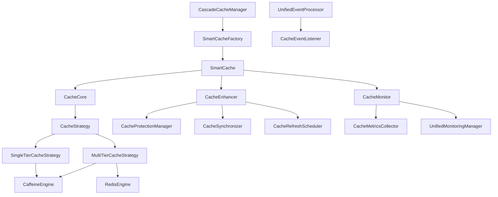

# Cascade Cache 模块架构功能设计文档

## 1. 概述

Cascade Cache 是一个高性能、多级缓存框架，提供了统一的缓存抽象层，支持 L1（本地缓存）+ L2（分布式缓存）的多级缓存架构。该模块采用现代化的设计模式，提供了丰富的企业级功能，包括缓存同步、防护机制、监控统计、事件系统等。

### 1.1 核心特性

- **多级缓存架构**：支持 L1（Caffeine）+ L2（Redis）的多级缓存
- **统一API设计**：提供一致的缓存操作接口
- **智能缓存管理**：职责分离的智能缓存实现
- **企业级功能**：防护机制、监控统计、事件系统
- **Spring Boot集成**：完整的自动配置支持
- **异步操作支持**：全面的异步缓存操作
- **注解驱动**：声明式缓存使用方式

### 1.2 技术栈

- **本地缓存**：Caffeine
- **分布式缓存**：Redis（通过 Redisson）
- **框架集成**：Spring Boot、Spring AOP
- **监控指标**：自定义指标收集系统
- **事件系统**：统一事件处理机制

## 2. 整体架构

### 2.1 架构层次

```
┌─────────────────────────────────────────────────────────────┐
│                    应用层 (Application Layer)                │
├─────────────────────────────────────────────────────────────┤
│                    注解层 (Annotation Layer)                 │
│  @CascadeCacheable, CascadeCacheAspect, CacheLoaderResolver │
├─────────────────────────────────────────────────────────────┤
│                    管理层 (Management Layer)                 │
│      CascadeCacheManager, CacheFactory, SmartCacheFactory   │
├─────────────────────────────────────────────────────────────┤
│                    核心层 (Core Layer)                       │
│    SmartCache, CacheCore, CacheEnhancer, CacheMonitor      │
├─────────────────────────────────────────────────────────────┤
│                    策略层 (Strategy Layer)                   │
│   MultiTierCacheStrategy, SingleTierCacheStrategy          │
├─────────────────────────────────────────────────────────────┤
│                    引擎层 (Engine Layer)                     │
│           CaffeineEngine, RedisEngine, CacheEngine         │
├─────────────────────────────────────────────────────────────┤
│                    基础层 (Foundation Layer)                 │
│     事件系统, 监控系统, 配置系统, 异常处理, 防护机制          │
└─────────────────────────────────────────────────────────────┘
```

### 2.2 核心组件关系



## 3. 核心组件设计

### 3.1 SmartCache - 智能缓存核心

`SmartCache` 是整个缓存系统的核心实现，采用职责分离设计模式：

```java
public class SmartCache<K, V> implements Cache<K, V>, AsyncCache<K, V>, TieredCache<K, V> {
    // 职责分离的三个核心组件
    private final CacheCore<K, V> core;           // 核心缓存逻辑
    private final CacheEnhancer<K, V> enhancer;   // 增强功能管理器
    private final CacheMonitor<K, V> monitor;     // 监控统计
}
```

**职责分工：**
- **CacheCore**：负责基础缓存操作的协调
- **CacheEnhancer**：负责防护、同步、刷新等增强功能
- **CacheMonitor**：负责监控统计和健康检查

### 3.2 CacheStrategy - 策略模式

采用策略模式处理不同的缓存架构：

#### 3.2.1 MultiTierCacheStrategy

```java
public class MultiTierCacheStrategy<K, V> implements CacheStrategy<K, V> {
    private final CacheEngine<K, V> l1Engine;  // L1缓存引擎
    private final CacheEngine<K, V> l2Engine;  // L2缓存引擎
    
    // 处理L1和L2之间的数据流转逻辑
}
```

**数据流转策略：**
1. **读取流程**：L1 → L2 → 数据源
2. **写入流程**：同时写入 L1 和 L2
3. **失效策略**：L1 失效后从 L2 加载

#### 3.2.2 SingleTierCacheStrategy

```java
public class SingleTierCacheStrategy<K, V> implements CacheStrategy<K, V> {
    private final CacheEngine<K, V> engine;  // 单级缓存引擎
    
    // 处理单级缓存的读写逻辑
}
```

### 3.3 CacheEngine - 缓存引擎

#### 3.3.1 CaffeineEngine（L1缓存）

```java
public class CaffeineEngine<K, V> implements CacheEngine<K, V> {
    private final com.github.benmanes.caffeine.cache.Cache<K, V> cache;
    
    // Caffeine配置
    public static class CaffeineConfig {
        private long maximumSize = 10000;
        private Duration expireAfterWrite = Duration.ofHours(1);
        private Duration expireAfterAccess = Duration.ofMinutes(30);
        // ...
    }
}
```

#### 3.3.2 RedisEngine（L2缓存）

```java
public class RedisEngine<K, V> implements CacheEngine<K, V> {
    private final RedissonClient redissonClient;
    
    // Redis配置
    public static class RedisConfig {
        private String keyPrefix = "cascade:cache:";
        private Duration defaultTtl = Duration.ofHours(24);
        private Duration timeout = Duration.ofSeconds(3);
        // ...
    }
}
```

### 3.4 构建器模式

采用分段构建器模式，提供清晰的构建流程：

```java
// 使用示例
Cache<String, User> cache = UnifiedCacheBuilder
    .forCache("userCache", String.class, User.class)
    .withL1AndL2(l1Config, l2Config, redissonClient)
    .enableProtection(protectionConfig)
    .enableCacheSync(syncConfig)
    .enableAutoRefresh(refreshConfig)
    .build();
```

**构建步骤：**
1. **TierConfigurationStep**：配置缓存层级
2. **EnhancementConfigurationStep**：配置增强功能
3. **Build**：构建最终缓存实例

## 4. 功能特性

### 4.1 防护机制

#### 4.1.1 布隆过滤器防护

```java
public class BloomFilterProtection<K> implements CacheProtection<K> {
    private final CascadeBloomFilter<K> bloomFilter;
    
    // 防止缓存穿透
    public boolean mightContain(K key) {
        return bloomFilter.mightContain(key);
    }
}
```

#### 4.1.2 随机TTL防护

```java
public class RandomTtlProtection implements CacheProtection<Object> {
    // 防止缓存雪崩
    public Duration randomizeTtl(Duration baseTtl) {
        double factor = 0.8 + Math.random() * 0.4; // 0.8-1.2倍
        return Duration.ofMillis((long) (baseTtl.toMillis() * factor));
    }
}
```

### 4.2 缓存同步

#### 4.2.1 统一同步器

```java
public class UnifiedCacheSynchronizer<K, V> implements CacheSynchronizer<K, V> {
    private final CacheSyncManager syncManager;
    private final UnifiedEventProcessor eventProcessor;
    
    // 处理缓存同步事件
    public void onCacheUpdate(K key, V value) {
        // 发布同步事件
        eventProcessor.publishEvent(
            UnifiedCacheEvent.sync(cacheId, key, value)
        );
    }
}
```

#### 4.2.2 Redis发布订阅同步

```java
public class RedissonCacheSyncManager implements CacheSyncManager {
    private final RedissonClient redissonClient;
    
    // 基于Redis发布订阅的缓存同步
    public void publishSync(String cacheId, Object key, SyncOperation operation) {
        RTopic topic = redissonClient.getTopic("cache:sync:" + cacheId);
        topic.publish(new SyncMessage(key, operation));
    }
}
```

### 4.3 自动刷新

```java
public class CacheRefreshScheduler<K, V> {
    private final ScheduledExecutorService scheduler;
    private final CacheLoader<K, V> cacheLoader;
    
    // 调度刷新任务
    public void scheduleRefresh(K key, Duration interval) {
        scheduler.scheduleWithFixedDelay(
            () -> refreshKey(key),
            interval.toMillis(),
            interval.toMillis(),
            TimeUnit.MILLISECONDS
        );
    }
}
```

### 4.4 监控统计

#### 4.4.1 指标收集

```java
public class CacheMetricsCollector {
    // 基础指标
    private final LongAdder hitCount = new LongAdder();
    private final LongAdder missCount = new LongAdder();
    private final LongAdder loadCount = new LongAdder();
    private final LongAdder evictionCount = new LongAdder();
    
    // 性能指标
    private final AtomicLong totalLoadTime = new AtomicLong();
    private final AtomicLong maxLoadTime = new AtomicLong();
    
    // 计算命中率
    public double getHitRate() {
        long hits = hitCount.sum();
        long total = hits + missCount.sum();
        return total == 0 ? 0.0 : (double) hits / total;
    }
}
```

#### 4.4.2 健康检查

```java
public class CacheMonitor<K, V> {
    // 健康状态检查
    public HealthStatus checkHealth() {
        try {
            // 检查缓存可用性
            testCacheAvailability();
            
            // 检查性能指标
            PerformanceMetrics metrics = getPerformanceMetrics();
            if (metrics.getHitRate() < 0.1) {
                return HealthStatus.degraded("Low hit rate: " + metrics.getHitRate());
            }
            
            return HealthStatus.up();
        } catch (Exception e) {
            return HealthStatus.down(e);
        }
    }
}
```

### 4.5 事件系统

#### 4.5.1 统一事件模型

```java
public class UnifiedCacheEvent {
    public enum Type {
        GET, PUT, EVICT, CLEAR, LOAD, SYNC, REFRESH, ERROR
    }
    
    private final String cacheId;
    private final Type type;
    private final Object key;
    private final Object value;
    private final Duration duration;
    private final boolean success;
    private final Throwable error;
}
```

#### 4.5.2 事件处理器

```java
public class UnifiedEventProcessor {
    private final List<CacheEventListener> listeners = new CopyOnWriteArrayList<>();
    private final ExecutorService executor;
    
    // 发布事件
    public void publishEvent(UnifiedCacheEvent event) {
        for (CacheEventListener listener : listeners) {
            if (listener.shouldHandle(event)) {
                executor.submit(() -> {
                    try {
                        listener.onEvent(event);
                    } catch (Exception e) {
                        log.warn("Event listener failed", e);
                    }
                });
            }
        }
    }
}
```

## 5. 注解支持

### 5.1 @CascadeCacheable 注解

```java
@Target({ElementType.METHOD})
@Retention(RetentionPolicy.RUNTIME)
public @interface CascadeCacheable {
    // 基础配置
    String value() default "";
    String cacheName() default "";
    String key() default "";
    String condition() default "";
    String unless() default "";
    
    // L1缓存配置
    long l1MaximumSize() default -1;
    String l1ExpireAfterWrite() default "";
    String l1ExpireAfterAccess() default "";
    
    // L2缓存配置
    String l2KeyPrefix() default "";
    String l2DefaultTtl() default "";
    String l2Timeout() default "";
    
    // 防护功能
    long bloomExpectedElements() default -1;
    double bloomFalsePositiveRate() default -1.0;
    boolean enableRandomTtl() default false;
    
    // 同步配置
    boolean enableCacheSync() default false;
    String syncChannel() default "";
    
    // 刷新配置
    boolean enableAutoRefresh() default false;
    String refreshInterval() default "";
    
    // 监控配置
    boolean enableMonitoring() default true;
    boolean enableMetrics() default true;
}
```

### 5.2 AOP切面处理

```java
@Aspect
@Component
public class CascadeCacheAspect {
    
    @Around("@annotation(cascadeCacheable)")
    public Object handleCacheable(ProceedingJoinPoint joinPoint, 
                                 CascadeCacheable cascadeCacheable) throws Throwable {
        
        String cacheKey = resolveCacheKey(joinPoint, cascadeCacheable);
        Cache<Object, Object> cache = getOrCreateCache(cascadeCacheable);
        
        // 尝试从缓存获取
        Object result = cache.get(cacheKey);
        if (result != null) {
            publishEvent(UnifiedCacheEvent.hit(cacheName, cacheKey));
            return result;
        }
        
        // 执行目标方法
        result = joinPoint.proceed();
        
        // 缓存结果
        if (result != null) {
            cache.put(cacheKey, result);
            publishEvent(UnifiedCacheEvent.put(cacheName, cacheKey, result));
        }
        
        return result;
    }
}
```

## 6. 配置管理

### 6.1 统一配置类

```java
@Data
@Accessors(chain = true)
public class CascadeCacheConfiguration {
    private String name = "default";
    private boolean enabled = true;
    
    // 各子配置
    private CommonConfig common = new CommonConfig();
    private L1Config l1 = new L1Config();
    private L2Config l2 = new L2Config();
    private SyncConfig sync = new SyncConfig();
    private ProtectionConfig protection = new ProtectionConfig();
    private MonitoringConfig monitoring = new MonitoringConfig();
    private RefreshConfig refresh = new RefreshConfig();
}
```

### 6.2 Spring Boot自动配置

```java
@Configuration
@EnableConfigurationProperties(CascadeCacheProperties.class)
@ConditionalOnProperty(prefix = "cascade.cache", name = "enabled", havingValue = "true", matchIfMissing = true)
public class CascadeCacheAutoConfiguration {
    
    @Bean
    @ConditionalOnMissingBean
    public CascadeCacheManager cascadeCacheManager(
            RedissonClient redissonClient,
            CachePropertiesProvider propertiesProvider,
            @Autowired(required = false) UnifiedMonitoringManager monitoringManager) {
        return new CascadeCacheManager(redissonClient, propertiesProvider, monitoringManager);
    }
}
```

## 7. 异常处理

### 7.1 分层异常处理

```java
public class CacheExceptionHandler {
    public enum ErrorSeverity {
        IGNORE,    // 忽略级别 - 仅记录调试日志
        WARN,      // 警告级别 - 记录警告日志
        ERROR,     // 错误级别 - 抛出CacheOperationException
        FATAL      // 致命级别 - 抛出CacheFatalException
    }
    
    public <T> T handleException(String operation, Exception e, 
                                ErrorSeverity severity, Supplier<T> fallback) {
        switch (severity) {
            case IGNORE:
                log.debug("Cache operation '{}' failed: {}", operation, e.getMessage());
                return fallback.get();
            case WARN:
                log.warn("Cache operation '{}' failed: {}", operation, e.getMessage());
                return fallback.get();
            case ERROR:
                log.error("Cache operation '{}' failed", operation, e);
                throw new CacheOperationException(operation, e);
            case FATAL:
                log.error("Fatal cache operation '{}' failed", operation, e);
                throw new CacheFatalException(operation, e);
            default:
                return fallback.get();
        }
    }
}
```

## 8. 性能优化

### 8.1 异步操作

```java
public interface AsyncCache<K, V> {
    CompletableFuture<V> getAsync(K key);
    CompletableFuture<Void> putAsync(K key, V value);
    CompletableFuture<Map<K, V>> getAllAsync(Set<K> keys);
    CompletableFuture<Void> putAllAsync(Map<K, V> map);
}
```

### 8.2 批量操作

```java
public class BatchOperationSupport<K, V> {
    private final int batchSize;
    private final Duration batchTimeout;
    
    // 批量获取优化
    public Map<K, V> batchGet(Set<K> keys) {
        if (keys.size() <= batchSize) {
            return directBatchGet(keys);
        }
        
        // 分批处理
        return keys.stream()
            .collect(Collectors.groupingBy(key -> key.hashCode() % batchSize))
            .values()
            .parallelStream()
            .map(this::directBatchGet)
            .flatMap(map -> map.entrySet().stream())
            .collect(Collectors.toMap(Map.Entry::getKey, Map.Entry::getValue));
    }
}
```

### 8.3 内存优化

```java
public class MemoryOptimization {
    // 弱引用缓存键
    private final Map<WeakReference<Object>, V> weakKeyCache = new ConcurrentHashMap<>();
    
    // 压缩序列化
    private final Serializer compressedSerializer = new CompressedSerializer();
    
    // 内存使用监控
    public void monitorMemoryUsage() {
        MemoryMXBean memoryBean = ManagementFactory.getMemoryMXBean();
        MemoryUsage heapUsage = memoryBean.getHeapMemoryUsage();
        
        double usageRatio = (double) heapUsage.getUsed() / heapUsage.getMax();
        if (usageRatio > 0.8) {
            // 触发缓存清理
            triggerCacheEviction();
        }
    }
}
```

## 9. 扩展点

### 9.1 SPI扩展机制

```java
// 缓存引擎扩展点
public interface CacheEngineProvider {
    String getEngineType();
    <K, V> CacheEngine<K, V> createEngine(Map<String, Object> config);
    boolean supports(String engineType);
}

// 序列化器扩展点
public interface SerializerProvider {
    String getSerializerType();
    Serializer createSerializer(Map<String, Object> config);
    boolean supports(String serializerType);
}

// 事件监听器扩展点
public interface CacheEventListenerProvider {
    String getListenerType();
    CacheEventListener createListener(Map<String, Object> config);
    boolean supports(String listenerType);
}
```

### 9.2 自定义缓存策略

```java
public abstract class CustomCacheStrategy<K, V> implements CacheStrategy<K, V> {
    protected abstract V doGet(K key);
    protected abstract void doPut(K key, V value);
    protected abstract void doEvict(K key);
    
    // 模板方法模式
    @Override
    public final V get(K key) {
        // 前置处理
        preGet(key);
        
        try {
            V value = doGet(key);
            // 后置处理
            postGet(key, value);
            return value;
        } catch (Exception e) {
            // 异常处理
            handleGetException(key, e);
            throw e;
        }
    }
}
```

## 10. 最佳实践

### 10.1 缓存设计原则

1. **合理的TTL设置**：根据数据特性设置合适的过期时间
2. **防护机制启用**：生产环境必须启用布隆过滤器和随机TTL
3. **监控指标关注**：重点关注命中率、响应时间、错误率
4. **异步操作优先**：高并发场景优先使用异步API
5. **批量操作优化**：大量数据操作使用批量接口

### 10.2 性能调优建议

1. **L1缓存容量**：根据内存大小合理设置，避免频繁GC
2. **L2缓存连接池**：合理配置Redis连接池参数
3. **序列化选择**：选择高效的序列化方案（如Kryo、Protobuf）
4. **网络优化**：启用Redis管道、批量操作
5. **监控告警**：设置合理的监控阈值和告警规则

### 10.3 故障处理

1. **降级策略**：缓存不可用时的降级处理
2. **熔断机制**：防止缓存故障影响主业务
3. **数据一致性**：缓存与数据库的一致性保证
4. **故障恢复**：缓存服务恢复后的数据重建

## 11. 总结

Cascade Cache 模块通过现代化的架构设计，提供了一个功能完整、性能优异的多级缓存解决方案。其核心优势包括：

1. **架构清晰**：职责分离的设计模式，易于理解和维护
2. **功能丰富**：提供了企业级应用所需的各种缓存功能
3. **性能优异**：多级缓存架构和异步操作支持
4. **易于集成**：完整的Spring Boot自动配置
5. **可扩展性**：丰富的扩展点和SPI机制
6. **生产就绪**：完善的监控、异常处理和故障恢复机制

该模块适用于各种规模的应用系统，从简单的单体应用到复杂的分布式系统，都能提供可靠的缓存服务支持。