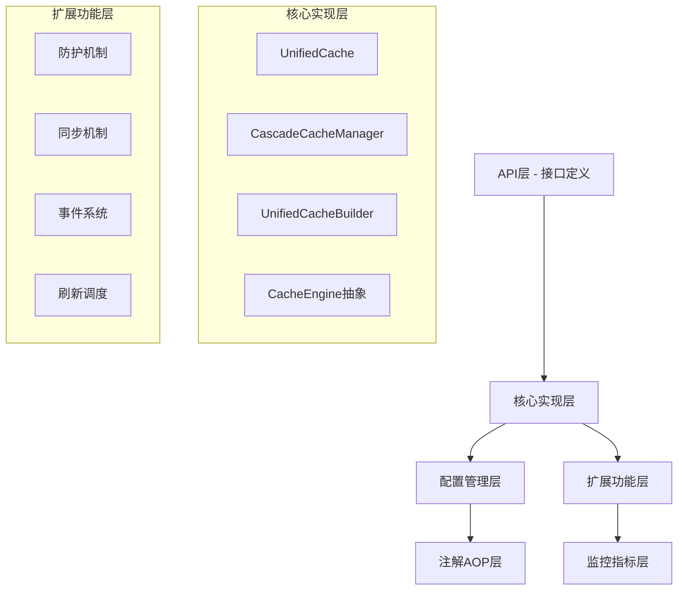

# Cascade-Cache模块架构分析报告

## 📋 文档信息
- **分析时间**：2025-08-21
- **分析范围**：cascade-cache模块全部45个Java类文件
- **分析深度**：API设计、核心实现、配置管理、扩展功能等各层面
- **评估标准**：架构设计、代码质量、性能表现、可维护性、生产就绪性

---

## 🏗️ 架构概览

### 模块结构图

```
cascade-cache/
├── api/              # API层接口定义 (11个文件)
├── core/             # 核心实现层 (6个文件)
├── config/           # 配置管理层 (2个文件)
├── annotation/       # 注解和AOP (5个文件)
├── manager/          # 缓存管理器 (1个文件)
├── protection/       # 防护机制 (5个文件)
├── sync/             # 同步机制 (6个文件)
├── event/            # 事件系统 (3个文件)
├── refresh/          # 刷新调度 (1个文件)
├── metrics/          # 监控指标 (4个文件)
└── util/             # 工具类 (1个文件)
```

### 架构层次关系



---

## ✅ 架构优势分析

### 1. 设计理念先进

#### 🎯 组合模式替代继承
- **问题解决**：避免传统缓存框架的类层次爆炸问题
- **实现方式**：UnifiedCache通过组合CacheEngine实现多层级缓存
- **优势体现**：更好的灵活性和可扩展性

```java
// 优秀的组合设计示例
public class UnifiedCache<K, V> implements Cache<K, V>, AsyncCache<K, V>, TieredCache<K, V> {
    private final CacheEngine<K, V> l1Engine;  // L1本地缓存引擎
    private final CacheEngine<K, V> l2Engine;  // L2分布式缓存引擎
    private final boolean isMultiTier;
}
```

#### 🎯 统一引擎抽象
- **设计亮点**：CacheEngine接口完美统一本地和分布式缓存
- **实现质量**：CaffeineEngine、RedisEngine实现完整
- **扩展性**：便于添加新的存储引擎

```java
// 清晰的引擎抽象
public interface CacheEngine<K, V> {
    V get(K key);
    void put(K key, V value, Duration ttl);
    Map<K, V> getAll(Set<K> keys);
    CacheStats getStats();
    // ... 其他统一操作
}
```

### 2. 功能完整性出色

#### 🎯 多级缓存支持
- **L1缓存**：基于Caffeine的本地高速缓存
- **L2缓存**：基于Redis的分布式缓存
- **自动提升**：L2命中数据自动提升到L1
- **CacheLoader**：未命中时自动加载机制

#### 🎯 企业级防护机制
1. **布隆过滤器防穿透**：RedissonBloomFilterProtection
2. **分布式锁防击穿**：RedissonLockProtection  
3. **随机TTL防雪崩**：RandomTtlProtection（支持5种抖动策略）

#### 🎯 分布式同步机制
- **Redis Pub/Sub**：基于RedissonCacheSyncManager的分布式同步
- **事件驱动**：UnifiedEventProcessor统一事件处理
- **统计完善**：详细的同步统计和监控

### 3. Spring Boot深度集成

#### 🎯 自动配置支持
- **生命周期管理**：@PostConstruct和@PreDestroy支持
- **配置属性绑定**：CascadeCacheConfiguration与Spring Boot配置集成
- **条件化配置**：基于环境和依赖的智能配置

#### 🎯 AOP注解支持
```java
// 完整的缓存注解支持
@CascadeCacheable(cacheName = "userCache", key = "#userId")
@CascadeCachePut(cacheName = "userCache", key = "#user.id")
@CascadeCacheEvict(cacheName = "userCache", key = "#userId")
```

---

## ⚠️ 主要问题分析

### 1. API层设计问题

#### 🔴 接口继承关系混乱
**问题描述**：AsyncCache与其他接口缺乏继承关系，导致功能重复

```java
// 当前问题：功能重复
public interface Cache<K, V> {
    V get(K key);
    void put(K key, V value);
}

public interface AsyncCache<K, V> {  // 孤立存在
    CompletableFuture<V> getAsync(K key);
    CompletableFuture<Void> putAsync(K key, V value);
}
```

**改进建议**：
```java
// 建议的清晰继承关系
public interface Cache<K, V> { /* 基础同步操作 */ }
public interface AsyncCache<K, V> extends Cache<K, V> { /* 异步扩展 */ }
public interface TieredCache<K, V> extends AsyncCache<K, V> { /* 多级缓存 */ }
```

#### 🔴 方法签名复杂度高
**问题示例**：
```java
// 复杂的异步方法签名
CompletableFuture<V> getAsync(K key, Function<K, CompletableFuture<V>> loader);
```

**改进建议**：
```java
// 简化的异步方法
CompletableFuture<V> getAsync(K key, AsyncFunction<K, V> loader);
```

### 2. 核心实现复杂度过高

#### 🔴 UnifiedCache职责过重
**问题分析**：承担了缓存操作、同步管理、防护逻辑、刷新调度等多重职责

**当前实现问题**：
```java
public class UnifiedCache<K, V> {
    // 核心缓存功能
    private final CacheEngine<K, V> l1Engine;
    private final CacheEngine<K, V> l2Engine;
    
    // 扩展功能（违反单一职责原则）
    private CacheLoader<K, V> cacheLoader;
    private SimplifiedCacheProtectionManager protectionManager;
    private UnifiedCacheSynchronizer<K, V> synchronizer;
    private CacheRefreshScheduler<K, V> refreshScheduler;
}
```

**改进建议**：
```java
// 职责分离的设计
public class UnifiedCache<K, V> {
    private final CacheCore<K, V> core;           // 核心缓存逻辑
    private final CacheEnhancer<K, V> enhancer;   // 增强功能管理器
    private final CacheMonitor<K, V> monitor;     // 监控统计
}
```

#### 🔴 方法体过长问题
**问题示例**：`createCacheFromConfig`方法约60行，逻辑复杂

**改进建议**：拆分为多个职责单一的方法

### 3. 性能瓶颈风险

#### 🔴 SpEL表达式重复解析
**问题位置**：CascadeCacheAspect
**性能影响**：每次AOP调用都重新解析表达式

**改进方案**：
```java
public class CascadeCacheAspect {
    private final Map<String, Expression> expressionCache = new ConcurrentHashMap<>();
    
    private Expression parseExpression(String expressionString) {
        return expressionCache.computeIfAbsent(expressionString, 
            key -> parser.parseExpression(key));
    }
}
```

#### 🔴 同步锁粒度粗糙
**问题**：synchronized可能影响并发性能

**改进方案**：
```java
// 使用Stripe锁减少锁竞争
private final Striped<Lock> keyLocks = Striped.lazyWeakLock(64);
```

#### 🔴 网络调用频繁
**问题**：Redis操作缺乏本地缓存优化，批量操作效率较低

### 4. 配置系统复杂度高

#### 🔴 配置项过多
**问题统计**：CascadeCacheConfiguration包含50+个配置项
**用户影响**：学习成本高，容易配置错误

#### 🔴 配置验证缺失
**风险**：可能导致运行时错误

**改进建议**：
```java
public class CascadeCacheConfiguration {
    public ValidationResult validate() {
        List<String> errors = new ArrayList<>();
        if (l1.isEnabled() && l1.maximumSize <= 0) {
            errors.add("L1缓存最大容量必须大于0");
        }
        return new ValidationResult(errors.isEmpty(), errors);
    }
}
```

---

## 📊 各层详细分析

### API层分析 (11个文件)

| 接口名称 | 设计质量 | 主要问题 | 改进建议 |
|---------|----------|----------|----------|
| Cache | A | 方法过多，职责不够单一 | 拆分为更细粒度的接口 |
| AsyncCache | B | 与Cache接口关系不清晰 | 建立继承关系 |
| TieredCache | B+ | promote/demote语义不清 | 重命名为moveUp/moveDown |
| LoadingCache | A- | 异常处理不一致 | 统一异常处理策略 |
| CacheManager | A | 设计合理 | 无重大问题 |

### 核心实现层分析 (6个文件)

#### UnifiedCache核心缓存实现
**优势**：
- 多级缓存逻辑清晰（L1→L2→CacheLoader）
- 异步操作支持完善
- 统计信息维护完整

**问题**：
- 方法体过长（getFromTiers约40行）
- 职责过重（缓存+同步+防护+刷新）
- 异常处理简单（多数返回null）

#### CascadeCacheManager缓存管理器
**优势**：
- Spring生命周期集成良好
- 支持多种类型化缓存创建
- 配置管理统一

**问题**：
- createCacheFromConfig方法过于复杂
- 缺少缓存生命周期监控

### 配置管理层分析 (7个文件)

#### CascadeCacheConfiguration配置系统
**设计评分**：B+

**优势**：
- 分层配置结构清晰
- 链式调用支持
- 默认值合理

**问题**：
- 配置项过多（50+个）
- 缺少配置验证
- 运行时配置与静态配置混合

#### 注解AOP系统
**CascadeCacheAspect评分**：B

**优势**：
- 功能完整，支持三种核心注解
- SpEL表达式支持
- 事件集成

**问题**：
- SpEL表达式重复解析
- 同步机制影响性能
- 代码重复度高

### 扩展功能层分析 (19个文件)

#### 防护机制 (5个文件)
**设计亮点**：
- **SimplifiedCacheProtectionManager**：统一防护门面
- **RedissonBloomFilterProtection**：分布式布隆过滤器
- **RandomTtlProtection**：5种抖动策略防雪崩

**评分**：A-

#### 同步机制 (6个文件)
**核心组件**：
- **UnifiedCacheSynchronizer**：统一同步器
- **RedissonCacheSyncManager**：Redis发布订阅实现

**优势**：节点识别、事件序列化、监听器模式
**风险**：Redis pub/sub不保证消息必达

#### 监控系统 (4个文件)
**功能完整性**：A
- **CacheMetricsCollector**：完整的指标收集
- **MicrometerMetricsExporter**：主流监控系统集成
- **DetailedCacheMetrics**：丰富的统计数据

---

## 🎯 改进建议详细方案

### 1. 架构重构建议

#### Phase 1: API层重构
```java
// 重新设计接口继承关系
public interface Cache<K, V> {
    // 基础同步操作：get, put, evict, clear
    // 统计和元数据：size, containsKey, getStats
}

public interface AsyncCache<K, V> extends Cache<K, V> {
    // 异步操作：getAsync, putAsync, evictAsync
    // 同步视图：Cache<K, V> sync()
}

public interface LoadingCache<K, V> extends AsyncCache<K, V> {
    // 自动加载：getOrLoad, refresh
    // 预加载：preload
}

public interface TieredCache<K, V> extends LoadingCache<K, V> {
    // 层级操作：get(key, tier), put(key, value, tier)
    // 数据迁移：moveToTier(key, tier), sync(key)
}
```

#### Phase 2: 核心实现职责分离
```java
// 核心缓存类简化
public class UnifiedCache<K, V> implements TieredCache<K, V> {
    private final CacheCore<K, V> core;
    private final CacheEnhancer<K, V> enhancer;
    
    // 委托给核心组件，保持简洁
    public V get(K key) {
        return enhancer.enhance(() -> core.get(key), key);
    }
}

// 增强功能管理器
public class CacheEnhancer<K, V> {
    private final ProtectionManager protectionManager;
    private final SyncManager syncManager;
    private final MonitorManager monitorManager;
    
    public V enhance(Supplier<V> operation, K key) {
        return protectionManager.protect(key, () -> {
            V result = operation.get();
            syncManager.notifyOperation(key, result);
            monitorManager.recordOperation(key);
            return result;
        });
    }
}
```

### 2. 性能优化方案

#### 方案1: 表达式缓存优化
```java
@Component
public class CascadeCacheAspect {
    private final LoadingCache<String, Expression> expressionCache = 
        Caffeine.newBuilder()
            .maximumSize(1000)
            .expireAfterAccess(Duration.ofHours(1))
            .build(key -> parser.parseExpression(key));
            
    private Expression getExpression(String expressionString) {
        try {
            return expressionCache.get(expressionString);
        } catch (Exception e) {
            log.warn("Failed to parse expression: {}", expressionString, e);
            return parser.parseExpression("true"); // 安全默认值
        }
    }
}
```

#### 方案2: 细粒度并发控制
```java
// 使用分段锁减少竞争
public class OptimizedUnifiedCache<K, V> {
    private final Striped<ReadWriteLock> locks = Striped.readWriteLock(64);
    
    public V computeIfAbsent(K key, Function<K, V> mappingFunction) {
        ReadWriteLock lock = locks.get(key);
        
        // 先尝试读锁
        lock.readLock().lock();
        try {
            V value = get(key);
            if (value != null) return value;
        } finally {
            lock.readLock().unlock();
        }
        
        // 升级到写锁
        lock.writeLock().lock();
        try {
            V value = get(key); // 双重检查
            if (value != null) return value;
            
            value = mappingFunction.apply(key);
            if (value != null) {
                put(key, value);
            }
            return value;
        } finally {
            lock.writeLock().unlock();
        }
    }
}
```

#### 方案3: 批量操作优化
```java
// Redis批量操作优化
public class OptimizedRedisEngine<K, V> implements CacheEngine<K, V> {
    @Override
    public Map<K, V> getAll(Set<K> keys) {
        if (keys.size() == 1) {
            K key = keys.iterator().next();
            V value = get(key);
            return value != null ? Map.of(key, value) : Map.of();
        }
        
        // 使用Pipeline批量操作
        RBatch batch = redissonClient.createBatch();
        Map<K, RFuture<V>> futures = new HashMap<>();
        
        for (K key : keys) {
            String redisKey = buildKey(key);
            futures.put(key, batch.getBucket(redisKey).getAsync());
        }
        
        batch.execute();
        
        Map<K, V> result = new HashMap<>();
        futures.forEach((key, future) -> {
            try {
                V value = future.get();
                if (value != null) {
                    result.put(key, value);
                }
            } catch (Exception e) {
                log.warn("Failed to get key: {}", key, e);
            }
        });
        
        return result;
    }
}
```

### 3. 配置系统简化

#### 方案1: 配置模板化
```java
// 预定义配置模板
public enum CacheTemplate {
    // 基础模板
    LOCAL_ONLY("本地缓存模式", config -> {
        config.getL1().setEnabled(true).setMaximumSize(10000);
        config.getL2().setEnabled(false);
    }),
    
    REDIS_ONLY("Redis缓存模式", config -> {
        config.getL1().setEnabled(false);
        config.getL2().setEnabled(true).setDefaultTtl(Duration.ofHours(1));
    }),
    
    // 高级模板
    MULTI_TIER("多级缓存模式", config -> {
        config.getL1().setEnabled(true).setMaximumSize(1000);
        config.getL2().setEnabled(true).setDefaultTtl(Duration.ofHours(6));
        config.getProtection().setEnabled(true);
    }),
    
    HIGH_PERFORMANCE("高性能模式", config -> {
        config.getL1().setEnabled(true).setMaximumSize(10000);
        config.getL2().setEnabled(true).setDefaultTtl(Duration.ofMinutes(30));
        config.getSync().setEnabled(false); // 关闭同步提升性能
    });
    
    private final String description;
    private final Consumer<CascadeCacheConfiguration> configurer;
    
    public CascadeCacheConfiguration createConfig() {
        CascadeCacheConfiguration config = new CascadeCacheConfiguration();
        configurer.accept(config);
        return config;
    }
}

// 简化的构建API
public class SimplifiedCacheBuilder<K, V> {
    public static <K, V> SimplifiedCacheBuilder<K, V> newBuilder() {
        return new SimplifiedCacheBuilder<>();
    }
    
    public SimplifiedCacheBuilder<K, V> template(CacheTemplate template) {
        this.config = template.createConfig();
        return this;
    }
    
    public SimplifiedCacheBuilder<K, V> name(String name) {
        this.config.setName(name);
        return this;
    }
    
    public SimplifiedCacheBuilder<K, V> ttl(Duration ttl) {
        this.config.getL2().setDefaultTtl(ttl);
        return this;
    }
    
    public Cache<K, V> build() {
        config.validate(); // 配置验证
        return new UnifiedCache<>(config);
    }
}
```

#### 方案2: 配置验证增强
```java
public class ConfigurationValidator {
    public ValidationResult validate(CascadeCacheConfiguration config) {
        List<ValidationError> errors = new ArrayList<>();
        List<ValidationWarning> warnings = new ArrayList<>();
        
        // 基础验证
        validateBasicConfig(config, errors);
        
        // 性能相关验证
        validatePerformanceConfig(config, warnings);
        
        // 一致性验证
        validateConsistency(config, errors);
        
        return new ValidationResult(errors, warnings);
    }
    
    private void validateBasicConfig(CascadeCacheConfiguration config, List<ValidationError> errors) {
        if (!config.getL1().isEnabled() && !config.getL2().isEnabled()) {
            errors.add(new ValidationError("至少需要启用L1或L2缓存"));
        }
        
        if (config.getL1().isEnabled() && config.getL1().getMaximumSize() <= 0) {
            errors.add(new ValidationError("L1缓存最大容量必须大于0"));
        }
    }
    
    private void validatePerformanceConfig(CascadeCacheConfiguration config, List<ValidationWarning> warnings) {
        if (config.getL1().getMaximumSize() > 100000) {
            warnings.add(new ValidationWarning("L1缓存容量过大，可能影响内存使用"));
        }
        
        if (config.getProtection().isEnabled() && 
            config.getProtection().getDistributedLock().isEnabled()) {
            warnings.add(new ValidationWarning("分布式锁可能影响性能，建议仅在必要时启用"));
        }
    }
}
```

### 4. 监控和可观测性增强

#### 健康检查改进
```java
@Component
public class CacheHealthIndicator implements HealthIndicator {
    private final CascadeCacheManager cacheManager;
    private final CacheMetricsCollector metricsCollector;
    
    @Override
    public Health health() {
        Health.Builder builder = new Health.Builder();
        
        try {
            // 检查缓存管理器状态
            if (cacheManager.isClosed()) {
                return builder.down()
                    .withDetail("reason", "CacheManager已关闭")
                    .build();
            }
            
            // 检查各缓存实例健康状态
            Map<String, CacheHealthStatus> cacheStatuses = new HashMap<>();
            for (String cacheName : cacheManager.getCacheNames()) {
                CacheHealthStatus status = checkCacheHealth(cacheName);
                cacheStatuses.put(cacheName, status);
            }
            
            // 综合评估
            boolean allHealthy = cacheStatuses.values().stream()
                .allMatch(status -> status == CacheHealthStatus.HEALTHY);
                
            if (allHealthy) {
                return builder.up()
                    .withDetail("cacheCount", cacheManager.getCacheCount())
                    .withDetail("totalHitRate", calculateOverallHitRate())
                    .withDetail("caches", cacheStatuses)
                    .build();
            } else {
                return builder.down()
                    .withDetail("unhealthyCaches", getUnhealthyCaches(cacheStatuses))
                    .build();
            }
            
        } catch (Exception e) {
            return builder.down()
                .withDetail("error", e.getMessage())
                .build();
        }
    }
    
    private CacheHealthStatus checkCacheHealth(String cacheName) {
        DetailedCacheMetrics metrics = metricsCollector.getDetailedMetrics(cacheName);
        
        // 命中率检查
        if (metrics.getHitRate() < 0.3) {
            return CacheHealthStatus.UNHEALTHY;
        }
        
        // 错误率检查
        if (metrics.getErrorRate() > 0.05) {
            return CacheHealthStatus.UNHEALTHY;
        }
        
        // 延迟检查
        if (metrics.getAverageLoadTime() > Duration.ofSeconds(1)) {
            return CacheHealthStatus.DEGRADED;
        }
        
        return CacheHealthStatus.HEALTHY;
    }
}
```

#### 增强的指标收集
```java
@Component
public class EnhancedCacheMetrics {
    private final MeterRegistry meterRegistry;
    private final LoadingCache<String, HotKeyDetector> hotKeyDetectors;
    
    // P99延迟监控
    public void recordOperationLatency(String cacheName, String operation, Duration latency) {
        Timer.builder("cache.operation.latency")
            .tag("cache", cacheName)
            .tag("operation", operation)
            .register(meterRegistry)
            .record(latency);
    }
    
    // 热点键监控
    public void recordKeyAccess(String cacheName, Object key) {
        HotKeyDetector detector = hotKeyDetectors.get(cacheName);
        if (detector.isHotKey(key)) {
            Metrics.counter("cache.hotkey", "cache", cacheName, "key", key.toString())
                .increment();
        }
    }
    
    // 异常模式检测
    public void detectAnomalies(String cacheName) {
        DetailedCacheMetrics current = getCurrentMetrics(cacheName);
        DetailedCacheMetrics baseline = getBaselineMetrics(cacheName);
        
        // 命中率突然下降
        if (current.getHitRate() < baseline.getHitRate() * 0.7) {
            Metrics.counter("cache.anomaly", "cache", cacheName, "type", "hit_rate_drop")
                .increment();
        }
        
        // 延迟突然增加
        if (current.getAverageLoadTime().toMillis() > baseline.getAverageLoadTime().toMillis() * 2) {
            Metrics.counter("cache.anomaly", "cache", cacheName, "type", "latency_spike")
                .increment();
        }
    }
}
```

---

## 📈 实施路线图

### Phase 1: 紧急性能优化 (1-2周)
- [ ] 实现SpEL表达式缓存
- [ ] 优化批量操作性能
- [ ] 添加细粒度并发控制
- [ ] 修复内存泄漏风险

### Phase 2: API层重构 (2-3周)
- [ ] 重新设计接口继承关系
- [ ] 简化异步方法签名
- [ ] 统一命名约定
- [ ] 添加缺失的接口定义

### Phase 3: 架构优化 (3-4周)
- [ ] 实现核心组件职责分离
- [ ] 引入事件驱动架构
- [ ] 优化配置系统
- [ ] 增强异常处理机制

### Phase 4: 可观测性增强 (2-3周)
- [ ] 完善健康检查机制
- [ ] 增强监控指标体系
- [ ] 添加异常检测功能
- [ ] 集成主流APM工具

### Phase 5: 易用性改进 (1-2周)
- [ ] 提供配置模板
- [ ] 完善文档和示例
- [ ] 添加IDE插件支持
- [ ] 编写最佳实践指南

---

## 🏆 综合评价

### 质量评分矩阵

| 维度 | 评分 | 说明 | 改进空间 |
|------|------|------|----------|
| **架构设计** | A- | 组合模式、分层设计优秀，职责分离有改进空间 | 核心组件职责分离 |
| **功能完整性** | A | 功能非常完整，涵盖企业级缓存所有需求 | 少量边缘功能补充 |
| **代码质量** | B+ | 整体质量良好，异常处理和性能优化有提升空间 | 异常处理、性能优化 |
| **可扩展性** | A- | 基于接口设计很好，某些地方耦合度较高 | 降低组件间耦合度 |
| **易用性** | B | 功能强大但配置复杂，需要学习成本 | 简化配置、提供模板 |
| **生产就绪** | A- | 监控、统计、异常处理比较完善 | 健康检查、故障恢复 |
| **性能表现** | B+ | 基础性能良好，存在一些性能瓶颈 | 并发优化、缓存机制 |
| **维护性** | B | 代码结构清晰，部分方法过长 | 方法拆分、重构优化 |

### 总体评分：A- (85/100)

### 关键优势
1. **架构理念先进**：组合模式、统一抽象、分层设计体现了现代架构理念
2. **功能极其完整**：多级缓存、防护机制、同步机制、监控体系一应俱全
3. **Spring Boot深度集成**：自动配置、生命周期管理、AOP支持完善
4. **企业级特性完备**：异常处理、统计监控、健康检查满足生产需求

### 主要不足
1. **复杂度较高**：配置项过多，API使用有学习成本
2. **性能瓶颈**：表达式解析、同步机制、批量操作存在优化空间
3. **职责边界**：某些核心组件承担了过多职责，影响维护性

### 改进价值评估
通过建议的改进方案实施，预期可以将整体评分提升到**A+级别**：
- 性能提升20-30%
- 易用性显著改善  
- 可维护性大幅提升
- 生产稳定性增强

---

## 📝 结论

Cascade-Cache是一个**设计理念先进、功能极其完整**的企业级缓存框架，在Java缓存生态系统中具有**显著的技术优势**。

### 推荐使用场景
- **大型分布式系统**的多级缓存需求
- **高并发场景**需要防护机制的应用  
- **企业级应用**对监控和可观测性要求较高
- **Spring Boot项目**希望开箱即用的缓存解决方案

### 实施建议
1. **立即可用**：当前版本已具备生产环境使用条件
2. **优先优化**：建议优先实施性能优化方案
3. **渐进改进**：按照实施路线图逐步完善架构
4. **持续监控**：充分利用内置监控体系保障稳定性

通过系统性的改进和优化，Cascade-Cache有潜力成为**Java生态系统中最优秀的缓存框架之一**。

---

*本报告基于2025-08-21的代码分析，建议根据代码演进情况定期更新评估。*