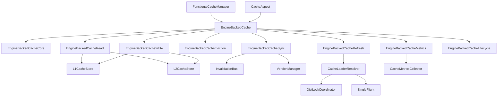

# Cascade Cache V2 架构与功能设计文档

## 1. 概述

Cascade Cache V2 是一个高性能、多级缓存框架，采用统一缓存引擎设计，支持注解式和编程式两种使用方式。V2 版本对架构进行了全面重构，采用职责分离设计，提供了更好的可维护性和扩展性。

### 1.1 核心特性

- **统一缓存引擎**：注解式与编程式共享同一 EngineBackedCache 内核
- **职责分离架构**：读写、刷新、同步、驱逐等职责独立实现
- **多级缓存**：L1（Caffeine 本地缓存）+ L2（Redisson 分布式缓存）
- **分布式同步**：基于 Redis Pub/Sub 的缓存失效同步
- **自动刷新**：支持定时刷新和软 TTL 刷新
- **防护机制**：SingleFlight 防击穿、分布式锁协调
- **完整监控**：指标收集、健康检查、性能统计
- **Spring Boot 集成**：完整的自动配置支持

### 1.2 技术栈

- **本地缓存**：Caffeine 3.1.8
- **分布式缓存**：Redis（通过 Redisson 4.3.1）
- **框架集成**：Spring Boot 3.2、Spring AOP
- **监控指标**：Micrometer 1.12.0
- **序列化**：Jackson JSON

### 1.3 V2 主要改进

1. **架构重构**：从函数式管道改为统一缓存引擎
2. **职责分离**：按职责拆分为多个独立类
3. **统一 API**：注解式和编程式完全统一
4. **性能优化**：优化数据流转和缓存策略
5. **一致性增强**：改进失效同步机制

## 2. 整体架构

### 2.1 分层架构

```
┌─────────────────────────────────────────────────────────────┐
│                    应用层 (Application Layer)                │
│                     @Cacheable, 编程式调用                    │
├─────────────────────────────────────────────────────────────┤
│                    门面层 (Facade Layer)                     │
│       CacheAspect (AOP), FunctionalCacheManager              │
├─────────────────────────────────────────────────────────────┤
│                    引擎层 (Engine Layer)                     │
│              EngineBackedCache (统一缓存引擎)                 │
│       ┌───────────────────────────────────────────┐          │
│       │  Core    Read    Write   Eviction         │          │
│       │  Refresh Sync    Metrics  Lifecycle       │          │
│       └───────────────────────────────────────────┘          │
├─────────────────────────────────────────────────────────────┤
│                    存储层 (Store Layer)                      │
│          L1CacheStore (本地) + L2CacheStore (分布式)          │
├─────────────────────────────────────────────────────────────┤
│                    一致性层 (Consistency Layer)              │
│       InvalidationBus (失效广播) + VersionManager (版本)     │
├─────────────────────────────────────────────────────────────┤
│                    加载层 (Loader Layer)                     │
│    CacheLoaderResolver + DistLockCoordinator + SingleFlight  │
├─────────────────────────────────────────────────────────────┤
│                    支撑层 (Support Layer)                    │
│      CacheKeyGenerator, TypeUtils, ObjectMapperHolder       │
└─────────────────────────────────────────────────────────────┘
```

### 2.2 核心组件关系



### 2.3 包结构

```
io.github.cascade.cache.v2
├── api                          # API 层
│   ├── Cache.java              # 统一缓存接口
│   ├── CacheManager.java       # 缓存管理器接口
│   ├── CacheLoader.java        # 加载器接口
│   └── annotations             # 缓存注解
│       ├── Cacheable.java
│       ├── CacheEvict.java
│       ├── CachePut.java
│       └── CascadeCached.java
├── facade                       # 门面层
│   ├── FunctionalCacheManager.java
│   └── CacheAspect.java
├── engine                       # 引擎层
│   ├── EngineBackedCache.java
│   ├── EngineBackedCacheCore.java
│   ├── EngineBackedCacheRead.java
│   ├── EngineBackedCacheWrite.java
│   ├── EngineBackedCacheEviction.java
│   ├── EngineBackedCacheRefresh.java
│   ├── EngineBackedCacheSync.java
│   ├── EngineBackedCacheMetrics.java
│   └── EngineBackedCacheLifecycle.java
├── store                        # 存储层
│   ├── l1                      # L1 本地缓存
│   │   ├── L1CacheStore.java
│   │   └── CaffeineL1Store.java
│   ├── l2                      # L2 分布式缓存
│   │   ├── L2CacheStore.java
│   │   └── RedissonL2Store.java
│   └── model                   # 存储模型
│       └── CacheRecord.java
├── consistency                  # 一致性层
│   ├── InvalidationBus.java
│   ├── RedisInvalidationBus.java
│   ├── VersionManager.java
│   └── RedisVersionManager.java
├── loader                       # 加载层
│   ├── CacheLoaderResolver.java
│   ├── DistLockCoordinator.java
│   ├── RedisDistLockCoordinator.java
│   └── SingleFlight.java
├── policy                       # 策略配置
│   ├── CachePolicy.java
│   ├── RefreshExecutionOptions.java
│   └── SyncMode.java
├── observability                # 可观测性
│   └── CacheMetricsCollector.java
└── support                      # 支撑工具
    ├── CacheKeyGenerator.java
    ├── DefaultCacheKeyGenerator.java
    ├── CacheKeyEncoder.java
    ├── TypeUtils.java
    └── ObjectMapperHolder.java
```

## 3. 核心组件设计

### 3.1 API 层

#### 3.1.1 Cache 接口

统一缓存接口，定义基础 CRUD 操作：

```java
public interface Cache<K, V> {
    // 基础操作
    Optional<V> get(K key);
    V getOrLoad(K key, Function<K, V> loader);
    void put(K key, V value);
    void put(K key, V value, long ttlSeconds);
    void evict(K key);
    void clear();

    // 批量操作
    Map<K, V> getAll(Iterable<K> keys);
    void putAll(Map<K, V> entries);

    // 异步操作
    CompletableFuture<Optional<V>> getAsync(K key);
    CompletableFuture<Void> putAsync(K key, V value);

    // 查询操作
    boolean containsKey(K key);
    long size();
    String getName();

    // 生命周期
    void close();
    boolean isClosed();
}
```

#### 3.1.2 CacheManager 接口

缓存管理器，支持多种缓存创建方式：

```java
public interface CacheManager {
    // 基础创建
    <K, V> Cache<K, V> getOrCreateCache(String cacheName,
                                         Class<K> keyType,
                                         Class<V> valueType);

    // 带配置创建
    <K, V> Cache<K, V> getOrCreateCache(String cacheName,
                                         Class<K> keyType,
                                         Class<V> valueType,
                                         CascadeCacheProperties config);

    // 带加载器创建
    <K, V> Cache<K, V> getOrCreateCache(String cacheName,
                                         Class<K> keyType,
                                         Class<V> valueType,
                                         Function<K, V> loader);

    // 完整配置创建
    <K, V> Cache<K, V> getOrCreateCache(String cacheName,
                                         Class<K> keyType,
                                         Class<V> valueType,
                                         CascadeCacheProperties config,
                                         Function<K, V> loader);

    // Builder 模式
    CacheBuilderKeyStage newCache(String cacheName);

    // CacheLoader 注册
    <K, V> void registerLoader(String cacheName,
                                Class<K> keyType,
                                Class<V> valueType,
                                CacheLoader<K, V> loader);
}
```

#### 3.1.3 CacheLoader 接口

数据加载器，继承自 Function：

```java
@FunctionalInterface
public interface CacheLoader<K, V> extends Function<K, V> {
    V load(K key);

    @Override
    default V apply(K key) {
        return load(key);
    }
}
```

#### 3.1.4 注解定义

**@Cacheable**：缓存查询注解

```java
@Target(ElementType.METHOD)
@Retention(RetentionPolicy.RUNTIME)
public @interface Cacheable {
    String value() default "";              // 缓存名称
    String key() default "";                // SpEL 表达式
    String condition() default "";          // 条件表达式
    String unless() default "";             // 排除条件
    boolean sync() default false;           // 是否同步
    CacheLoaderBinding loaderBinding() default @CacheLoaderBinding; // 加载器绑定
}
```

**@CacheEvict**：缓存删除注解

```java
@Target(ElementType.METHOD)
@Retention(RetentionPolicy.RUNTIME)
public @interface CacheEvict {
    String value() default "";              // 缓存名称
    String key() default "";                // SpEL 表达式
    String condition() default "";          // 条件表达式
    boolean allEntries() default false;     // 是否清空所有
    boolean beforeInvocation() default false; // 是否在方法执行前失效
}
```

**@CachePut**：缓存更新注解

```java
@Target(ElementType.METHOD)
@Retention(RetentionPolicy.RUNTIME)
public @interface CachePut {
    String value() default "";              // 缓存名称
    String key() default "";                // SpEL 表达式
    String condition() default "";          // 条件表达式
    String unless() default "";             // 排除条件
}
```

### 3.2 Facade 层

#### 3.2.1 FunctionalCacheManager

函数式缓存管理器，统一管理所有缓存实例：

```java
public class FunctionalCacheManager implements CacheManager {
    // 缓存注册表
    private final ConcurrentHashMap<String, Cache<?, ?>> cacheRegistry;
    private final ConcurrentHashMap<String, CacheDefinitionFingerprint> definitionRegistry;

    // 依赖组件
    private final RedissonClient redissonClient;
    private final CascadeCacheProperties defaultConfig;
    private final CacheLoaderResolver loaderResolver;
    private final MeterRegistry meterRegistry;
    private final String nodeId;

    @Override
    public <K, V> Cache<K, V> getOrCreateCache(String cacheName,
                                               Class<K> keyType,
                                               Class<V> valueType,
                                               CascadeCacheProperties config,
                                               Function<K, V> loader) {
        // 创建或获取缓存
        // 1. 检查是否已存在
        // 2. 解析 CachePolicy
        // 3. 解析 RefreshExecutionOptions
        // 4. 创建 EngineBackedCache
        // 5. 注册缓存
    }
}
```

#### 3.2.2 CacheAspect

统一缓存切面，处理所有缓存注解：

```java
@Aspect
@Order(1)
public class CacheAspect {
    private final CacheManager cacheManager;
    private final CascadeCacheProperties defaultConfig;
    private final CacheExpressionEvaluator expressionEvaluator;

    // InvocationSnapshot 用于自动刷新回放
    private final Cache<SnapshotKey, InvocationSnapshot> invocationSnapshots;

    @Around("@annotation(cacheable)")
    public Object handleCacheable(ProceedingJoinPoint joinPoint,
                                 Cacheable cacheable) throws Throwable {
        // 1. 解析 cacheName 和 key
        // 2. 评估条件表达式
        // 3. 注册 InvocationSnapshot
        // 4. 获取或创建缓存
        // 5. 执行缓存查询
    }

    @Around("@annotation(cacheEvict)")
    public Object handleCacheEvict(ProceedingJoinPoint joinPoint,
                                   CacheEvict cacheEvict) throws Throwable {
        // 处理缓存删除
    }

    @Around("@annotation(cachePut)")
    public Object handleCachePut(ProceedingJoinPoint joinPoint,
                                CachePut cachePut) throws Throwable {
        // 处理缓存更新
    }
}
```

### 3.3 Engine 层

#### 3.3.1 EngineBackedCache 统一引擎

统一缓存引擎实现，采用职责分离设计：

```java
public class EngineBackedCache<K, V> implements Cache<K, V> {
    // 核心状态
    private final String cacheName;
    private final CachePolicy policy;
    private final L1CacheStore<K, V> l1Store;
    private final L2CacheStore<K, V> l2Store;
    private final Class<V> valueType;
    private final ObjectMapper objectMapper;
    private final String nodeId;

    // 策略配置
    private final RefreshExecutionOptions refreshOptions;
    private final CacheMetricsCollector metricsCollector;

    // 线程池
    private final ExecutorService asyncExecutor;
    private final ThreadPoolExecutor refreshExecutor;
    private final ScheduledExecutorService refreshScheduler;

    // 防护机制
    private final SingleFlight<K, V> singleFlight;

    // Pipeline
    private final ReadPipeline<K, V> readPipeline;
    private final WritePipeline<V> writePipeline;
    private final RefreshPipeline refreshPipeline;

    // 职责分离的委托
    private final EngineBackedCacheEviction<K, V> evictionDelegate;
    private final EngineBackedCacheWrite<K, V> writeDelegate;
    private final EngineBackedCacheRefresh<K, V> refreshDelegate;
    private final EngineBackedCacheSync<K, V> syncDelegate;
    private final EngineBackedCacheLifecycle<K, V> lifecycleDelegate;

    // 指标统计
    private final AtomicLong l1Hit = new AtomicLong(0L);
    private final AtomicLong l2Hit = new AtomicLong(0L);
    private final AtomicLong miss = new AtomicLong(0L);
    // ... 更多指标
}
```

#### 3.3.2 职责分离设计

**EngineBackedCacheCore**：核心逻辑

```java
class EngineBackedCacheCore<K, V> {
    // 核心状态管理
    // 共享工具方法
    // 基础协调逻辑
}
```

**EngineBackedCacheRead**：读操作

```java
class EngineBackedCacheRead<K, V> {
    Optional<V> get(K key);
    V getOrLoad(K key, Function<K, V> loader);
    Map<K, V> getAll(Iterable<K> keys);

    // 读流程：
    // 1. 检查 L1
    // 2. L1 未命中检查 L2
    // 3. L2 未命中使用 Loader
    // 4. 异步回填 L1
}
```

**EngineBackedCacheWrite**：写操作

```java
class EngineBackedCacheWrite<K, V> {
    void put(K key, V value);
    void put(K key, V value, long ttlSeconds);
    void putAll(Map<K, V> entries);

    // 写流程：
    // 1. 同步写入 L2
    // 2. 异步写入 L1
    // 3. 发布失效事件（如果启用）
}
```

**EngineBackedCacheEviction**：失效操作

```java
class EngineBackedCacheEviction<K, V> {
    void evict(K key);
    void clear();

    // 失效流程：
    // 1. 从 L1 删除
    // 2. 从 L2 删除
    // 3. 发布失效事件（如果启用）
}
```

**EngineBackedCacheRefresh**：刷新操作

```java
class EngineBackedCacheRefresh<K, V> {
    void scheduleRefresh(K key);
    void startRefreshScheduler();
    void stopRefreshScheduler();

    // 刷新流程：
    // 1. 定时扫描需要刷新的 key
    // 2. 使用 Loader 加载最新数据
    // 3. 更新 L2 和 L1
}
```

**EngineBackedCacheSync**：同步操作

```java
class EngineBackedCacheSync<K, V> {
    void publishInvalidation(K key);
    void subscribeInvalidations();
    void handleInvalidationEvent(InvalidationEvent event);

    // 同步流程：
    // 1. 本地失效
    // 2. 发布到 Redis Pub/Sub
    // 3. 其他节点监听并失效
}
```

**EngineBackedCacheMetrics**：指标收集

```java
class EngineBackedCacheMetrics<K, V> {
    CacheStatsSnapshot getStats();
    void recordHit(CacheLevel level);
    void recordMiss();
    void recordLoadSuccess(Duration duration);
    void recordLoadFailure(Throwable error);
}
```

**EngineBackedCacheLifecycle**：生命周期管理

```java
class EngineBackedCacheLifecycle<K, V> {
    void initialize();
    void start();
    void stop();
    void close();
}
```

### 3.4 Store 层

#### 3.4.1 L1CacheStore 接口

本地缓存存储接口：

```java
public interface L1CacheStore<K, V> {
    Optional<V> get(K key);
    void put(K key, V value);
    void put(K key, V value, long ttlSeconds);
    void evict(K key);
    void clear();
    long size();
    void close();
}
```

**CaffeineL1Store**：Caffeine 实现

```java
public class CaffeineL1Store<K, V> implements L1CacheStore<K, V> {
    private final com.github.benmanes.caffeine.cache.Cache<K, CacheRecord> cache;

    public CaffeineL1Store(CachePolicy.L1Policy policy) {
        this.cache = Caffeine.newBuilder()
            .maximumSize(policy.getMaximumSize())
            .expireAfterWrite(policy.getExpireAfterWrite())
            .recordStats(policy.isRecordStats())
            .build();
    }
}
```

#### 3.4.2 L2CacheStore 接口

分布式缓存存储接口：

```java
public interface L2CacheStore<K, V> {
    Optional<CacheRecord> get(K key);
    void put(K key, CacheRecord record);
    void evict(K key);
    void clear();
    Long getTtl(K key);
    void close();
}
```

**RedissonL2Store**：Redisson 实现

```java
public class RedissonL2Store<K, V> implements L2CacheStore<K, V> {
    private final RedissonClient redissonClient;
    private final String keyPrefix;
    private final long defaultTtlSeconds;
    private final ObjectMapper objectMapper;

    @Override
    public Optional<CacheRecord> get(K key) {
        String cacheKey = encodeKey(key);
        RBucket<String> bucket = redissonClient.getBucket(cacheKey);
        String json = bucket.get();
        if (json == null) {
            return Optional.empty();
        }
        return Optional.of(objectMapper.readValue(json, CacheRecord.class));
    }
}
```

#### 3.4.3 CacheRecord 模型

缓存记录模型：

```java
public class CacheRecord {
    private Object value;           // 缓存值
    private long version;           // 版本号
    private long expireTime;        // 过期时间戳
    private long createTime;        // 创建时间戳
    private long updateTime;        // 更新时间戳
    private String nodeId;          // 节点ID

    // getters and setters
}
```

### 3.5 Consistency 层

#### 3.5.1 InvalidationBus 接口

失效总线接口：

```java
public interface InvalidationBus {
    void publish(String cacheName, Object key);
    void subscribe(String cacheName, InvalidationListener listener);
    void unsubscribe(String cacheName);
    void close();
}
```

**RedisInvalidationBus**：Redis Pub/Sub 实现

```java
public class RedisInvalidationBus implements InvalidationBus {
    private final RedissonClient redissonClient;
    private final String topicPrefix;
    private final ObjectMapper objectMapper;

    @Override
    public void publish(String cacheName, Object key) {
        InvalidationEvent event = new InvalidationEvent(cacheName, key);
        String topic = topicPrefix + cacheName;
        RTopic rTopic = redissonClient.getTopic(topic);
        rTopic.publish(event);
    }

    @Override
    public void subscribe(String cacheName, InvalidationListener listener) {
        String topic = topicPrefix + cacheName;
        RTopic rTopic = redissonClient.getTopic(topic);
        rTopic.addListener(InvalidationEvent.class, (channel, event) -> {
            listener.onInvalidation(event);
        });
    }
}
```

#### 3.5.2 VersionManager 接口

版本管理器接口：

```java
public interface VersionManager {
    long getCurrentVersion();
    long incrementAndGetVersion();
    boolean isVersionValid(long version);
}
```

**LocalVersionManager**：本地版本管理

**RedisVersionManager**：Redis 版本管理

### 3.6 Loader 层

#### 3.6.1 CacheLoaderResolver

加载器解析器：

```java
public class CacheLoaderResolver {
    private final ApplicationContext applicationContext;
    private final ConcurrentHashMap<LoaderKey, CacheLoader<?, ?>> loaderCache = new ConcurrentHashMap<>();

    public <K, V> CacheLoader<K, V> resolve(String cacheName,
                                            Class<K> keyType,
                                            Class<V> valueType) {
        LoaderKey key = new LoaderKey(cacheName, keyType, valueType);
        return (CacheLoader<K, V>) loaderCache.computeIfAbsent(key, k -> {
            // 1. 尝试从 @CacheLoaderBinding 注解解析
            // 2. 尝试从 Spring 容器中查找
            // 3. 返回 null
        });
    }
}
```

#### 3.6.2 SingleFlight

防击穿机制：

```java
public class SingleFlight<K, V> {
    private final ConcurrentHashMap<K, CompletableFuture<V>> calls = new ConcurrentHashMap<>();

    public CompletableFuture<V> execute(K key, Function<K, V> loader) {
        CompletableFuture<V> future = calls.get(key);
        if (future != null) {
            return future;
        }

        CompletableFuture<V> newFuture = new CompletableFuture<>();
        CompletableFuture<V> racingFuture = calls.putIfAbsent(key, newFuture);
        if (racingFuture != null) {
            return racingFuture;
        }

        try {
            V value = loader.apply(key);
            newFuture.complete(value);
            return newFuture;
        } catch (Exception e) {
            newFuture.completeExceptionally(e);
            throw e;
        } finally {
            calls.remove(key);
        }
    }
}
```

#### 3.6.3 DistLockCoordinator

分布式锁协调器：

```java
public interface DistLockCoordinator<K> {
    enum Outcome { ACQUIRED, NOT_ACQUIRED, ERROR }

    record LockResult<T>(Outcome outcome, T value, Throwable error) {
        static <T> LockResult<T> acquired(T value) {
            return new LockResult<>(Outcome.ACQUIRED, value, null);
        }

        static <T> LockResult<T> notAcquired() {
            return new LockResult<>(Outcome.NOT_ACQUIRED, null, null);
        }

        static <T> LockResult<T> error(Throwable error) {
            return new LockResult<>(Outcome.ERROR, null, error);
        }
    }

    <T> LockResult<T> withLock(String cacheName,
                               K key,
                               long waitMs,
                               long leaseMs,
                               Supplier<T> supplier);
}
```

**RedisDistLockCoordinator**：Redis 实现

```java
public class RedisDistLockCoordinator<K> implements DistLockCoordinator<K> {
    private final RedissonClient redissonClient;

    @Override
    public <T> LockResult<T> withLock(String cacheName,
                                      K key,
                                      long waitMs,
                                      long leaseMs,
                                      Supplier<T> supplier) {
        RLock lock = redissonClient.getLock(lockPrefix + encodeKey(key));
        boolean locked = false;
        try {
            locked = lock.tryLock(Math.max(0L, waitMs), Math.max(1L, leaseMs), TimeUnit.MILLISECONDS);
            if (!locked) {
                return LockResult.notAcquired();
            }
            return LockResult.acquired(supplier.get());
        } catch (InterruptedException e) {
            Thread.currentThread().interrupt();
            return LockResult.error(e);
        } catch (Exception e) {
            return LockResult.error(e);
        } finally {
            if (locked && lock.isHeldByCurrentThread()) {
                lock.unlock();
            }
        }
    }
}
```

### 3.7 Support 层

#### 3.7.1 CacheKeyGenerator

缓存键生成器接口：

```java
public interface CacheKeyGenerator {
    Object generate(Object target, Method method, Object... params);
}
```

**DefaultCacheKeyGenerator**：SpEL 支持

```java
public class DefaultCacheKeyGenerator implements CacheKeyGenerator {
    private final SpelExpressionParser parser = new SpelExpressionParser();
    private final CacheExpressionEvaluator evaluator;

    @Override
    public Object generate(Object target, Method method, Object... params) {
        // 支持 SpEL 表达式解析
        // 默认使用参数哈希
    }
}
```

#### 3.7.2 CacheKeyEncoder

缓存键编码器：

```java
public class CacheKeyEncoder {
    public static String encode(Object key) {
        if (key == null) {
            return "null";
        }
        // 使用 Jackson 序列化为 JSON 字符串
        // 或者使用 toString() + 类型信息
    }
}
```

#### 3.7.3 TypeUtils

类型工具类：

```java
public class TypeUtils {
    public static Class<?> getRawType(Type type) {
        // 获取原始类型
    }

    public static boolean isPrimitive(Class<?> type) {
        // 判断是否是基本类型
    }
}
```

## 4. 数据流转

### 4.1 读取流程

```
┌──────────────┐
│  用户请求    │
└──────┬───────┘
       │
       ▼
┌─────────────────────────────────────────────────────────────┐
│              EngineBackedCacheRead.get()                    │
├─────────────────────────────────────────────────────────────┤
│  1. 检查 L1 缓存                                           │
│     ├─ 命中 → 返回结果，更新 L1 命中指标                     │
│     └─ 未命中 ↓                                            │
│  2. 检查 L2 缓存                                           │
│     ├─ 命中 → 返回结果，异步回填 L1，更新 L2 命中指标        │
│     └─ 未命中 ↓                                            │
│  3. 使用 SingleFlight 防击穿                               │
│  4. 若启用 distributedLock，通过 DistLockCoordinator 加锁   │
│  5. 使用 CacheLoader 加载数据                              │
│     ├─ 成功 → 同步写入 L2，异步回填 L1                      │
│     ├─ 未获取锁 → 按 LockFailureStrategy 退化或放弃加载     │
│     └─ 失败 → 记录失败指标，抛出异常                        │
└─────────────────────────────────────────────────────────────┘
```

### 4.2 写入流程

```
┌──────────────┐
│  用户请求    │
└──────┬───────┘
       │
       ▼
┌─────────────────────────────────────────────────────────────┐
│              EngineBackedCacheWrite.put()                   │
├─────────────────────────────────────────────────────────────┤
│  1. 创建 CacheRecord（包含版本号、时间戳）                  │
│  2. 同步写入 L2 缓存                                        │
│  3. 异步写入 L1 缓存                                        │
│  4. 如果启用同步，发布失效事件到 Redis Pub/Sub              │
└─────────────────────────────────────────────────────────────┘
```

### 4.3 失效流程

```
┌──────────────┐
│  用户请求    │
└──────┬───────┘
       │
       ▼
┌─────────────────────────────────────────────────────────────┐
│            EngineBackedCacheEviction.evict()                │
├─────────────────────────────────────────────────────────────┤
│  1. 从 L1 缓存删除                                          │
│  2. 从 L2 缓存删除                                          │
│  3. 发布失效事件到 Redis Pub/Sub                            │
│  4. 其他节点监听事件，本地失效                               │
└─────────────────────────────────────────────────────────────┘
```

### 4.4 刷新流程

```
┌─────────────────────────────────────────────────────────────┐
│            EngineBackedCacheRefresh.refresh()               │
├─────────────────────────────────────────────────────────────┤
│  1. 定时任务扫描需要刷新的 key                               │
│  2. 检查 key 是否在跟踪列表中                               │
│  3. 使用 CacheLoader 异步加载最新数据                       │
│  4. 更新 L2 缓存                                            │
│  5. 异步回填 L1 缓存                                        │
│  6. 更新刷新成功/失败指标                                   │
└─────────────────────────────────────────────────────────────┘
```

### 4.5 同步流程

```
┌─────────────────────────────────────────────────────────────┐
│              EngineBackedCacheSync.sync()                   │
├─────────────────────────────────────────────────────────────┤
│  发布节点：                                                 │
│  1. 执行本地失效操作                                        │
│  2. 发布失效事件到 Redis Pub/Sub                            │
│                                                             │
│  订阅节点：                                                 │
│  3. 监听 Redis Pub/Sub 事件                                │
│  4. 解析失效事件                                            │
│  5. 本地失效对应的 key                                      │
│  6. 更新版本号，防止重复失效                                │
└─────────────────────────────────────────────────────────────┘
```

## 5. 配置管理

### 5.1 CascadeCacheProperties

```yaml
cascade:
  enabled: true
  default-cache-name: default

  # L1 本地缓存配置
  l1:
    enabled: true
    maximum-size: 10000
    expire-after-write-seconds: 3600
    record-stats: true

  # L2 分布式缓存配置
  l2:
    enabled: true
    key-prefix: "cascade:"
    default-ttl-seconds: 7200

  # 分布式同步配置
  sync:
    enabled: true
    topic-prefix: "cache:sync:"
    mode: all  # all, l2

  # 缓存刷新配置
  refresh:
    enabled: true
    default-refresh-interval-seconds: 600
    thread-pool-size: 2
    retry-max-attempts: 3
```

### 5.2 CachePolicy

```java
public class CachePolicy {
    private boolean l1Enabled;
    private boolean l2Enabled;
    private long l1MaximumSize;
    private Duration l1ExpireAfterWrite;
    private String l2KeyPrefix;
    private long l2DefaultTtl;
    private SyncMode syncMode;
    // ...
}
```

### 5.3 RefreshExecutionOptions

```java
public class RefreshExecutionOptions {
    private Duration refreshInterval;
    private int threadPoolSize;
    private int retryMaxAttempts;
    private Duration retryInitialDelay;
    // ...
}
```

## 6. 性能优化

### 6.1 异步操作

- **写操作异步化**：L1 写入异步执行，不阻塞主流程
- **刷新操作异步化**：使用独立线程池执行刷新任务
- **事件发布异步化**：失效事件异步发布

### 6.2 批量操作

- **批量获取**：`getAll()` 方法支持批量查询
- **批量写入**：`putAll()` 方法支持批量写入

### 6.3 缓存策略

- **L1 回填**：L2 命中后异步回填 L1
- **SingleFlight**：防止缓存击穿，减少重复加载
- **版本去重**：防止重复处理失效事件

### 6.4 内存优化

- **Caffeine 配置**：合理配置 maximumSize 和过期策略
- **缓存淘汰**：自动淘汰不常用的数据
- **弱引用**：对大对象使用弱引用

## 7. 监控指标

### 7.1 基础指标

- **命中率**：L1 命中率、L2 命中率、总体命中率
- **操作计数**：L1 命中次数、L2 命中次数、未命中次数
- **回填计数**：L1 回填次数、L2 回填次数

### 7.2 性能指标

- **加载时间**：平均加载时间、最大加载时间
- **响应时间**：平均响应时间、P95、P99
- **队列大小**：异步任务队列大小

### 7.3 错误指标

- **加载失败**：加载失败次数、失败率
- **同步失败**：同步失败次数
- **锁降级**：分布式锁降级次数

### 7.4 刷新指标

- **刷新成功**：刷新成功次数
- **刷新失败**：刷新失败次数
- **刷新队列**：待刷新 key 数量

## 8. 最佳实践

### 8.1 缓存设计

1. **合理的 TTL**：根据数据特性设置合适的过期时间
2. **合理的容量**：根据内存大小设置 L1 容量
3. **启用同步**：分布式环境必须启用失效同步
4. **启用刷新**：对热点数据启用自动刷新

### 8.2 性能优化

1. **优先使用 L1**：L1 性能远高于 L2
2. **批量操作**：大量数据使用批量接口
3. **异步操作**：写操作使用异步接口
4. **监控指标**：重点关注命中率和响应时间

### 8.3 故障处理

1. **降级策略**：L2 不可用时降级到 L1
2. **熔断机制**：加载失败时返回降级值
3. **重试机制**：加载失败时自动重试
4. **异常隔离**：缓存异常不影响业务

## 9. 总结

Cascade Cache V2 通过统一缓存引擎和职责分离设计，提供了一个功能完整、性能优异、易于维护的多级缓存解决方案。

### 9.1 核心优势

1. **架构清晰**：职责分离，层次分明
2. **统一 API**：注解式和编程式完全统一
3. **功能丰富**：多级缓存、失效同步、自动刷新
4. **性能优异**：异步操作、批量支持、防击穿
5. **易于集成**：完整的 Spring Boot 自动配置
6. **生产就绪**：完善的监控、异常处理

### 9.2 适用场景

- **高并发查询**：热点数据缓存
- **分布式系统**：多节点缓存同步
- **数据一致性**：强一致性要求
- **性能优化**：降低数据库压力

### 9.3 未来规划

1. 支持更多存储引擎（如 Memcached）
2. 支持更多序列化方式（如 Kryo、Protobuf）
3. 支持更多同步策略（如版本控制、时间戳）
4. 支持更多刷新策略（如懒加载、预加载）
